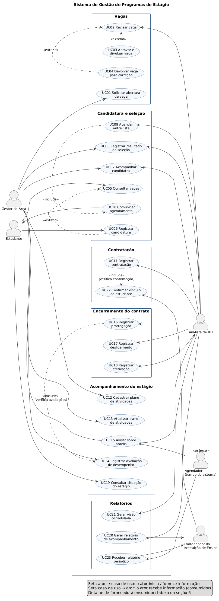

# TP2 — Casos de Uso · Sistema de Gestão de Programas de Estágio

**Aluno:** Gabriel Alves Sandre da Silva  
**Disciplina:** Projeto de Bloco — TP2  
**Base:** Resumo de Requisitos do TP1 (24/08/2026)  
**Contexto metodológico:** RUP — Fase de Iniciação, disciplina de Requisitos (Modelo de Casos de Uso)

---

## 1. Visão geral

O Sistema de Gestão de Programas de Estágio centraliza a condução do programa de estágio de uma empresa de médio porte. Hoje esse processo é fragmentado: planilhas isoladas e trocas de e-mail entre o RH, os gestores das áreas e as instituições de ensino. O sistema oferece um ponto único em que a vaga é divulgada, o estudante se candidata, o processo seletivo é acompanhado e, após a contratação, o plano de atividades, as avaliações periódicas e a vigência do termo de compromisso passam a ser registrados e monitorados.

No TP1 foram definidos os usuários, os requisitos funcionais (RF01 a RF12), as regras de negócio e os limites de escopo. Neste TP2 esses requisitos são formalizados como **casos de uso**. Na fase de Iniciação do RUP, o Modelo de Casos de Uso delimita o escopo do sistema e serve de base para a Elaboração, quando os casos de uso de maior risco serão detalhados e usados para validar a arquitetura.

---

## 2. Atores e interações com o sistema

### 2.1 Atores humanos (definidos no TP1)

| Ator | Descrição | Como interage com o sistema |
| --- | --- | --- |
| **Analista de Recursos Humanos** | Conduz o programa de estágio. | Revisa, aprova, divulga ou devolve vagas; acompanha candidatos e registra resultados; agenda entrevistas; formaliza a contratação; registra prorrogação, desligamento ou efetivação; recebe avisos de prazo; gera relatórios e a visão consolidada do programa. |
| **Gestor da área** | Responsável pela área que recebe o estagiário e seu supervisor. | Solicita a abertura da vaga; participa da seleção; cadastra e atualiza o plano de atividades; registra as avaliações de desempenho; recebe avisos de prazo. |
| **Estudante** | Candidato à vaga e, depois de contratado, estagiário. | Consulta vagas; registra candidatura com dados de formação; acompanha a candidatura e recebe o agendamento de entrevistas; depois de contratado, consulta contrato, avaliações e pendências. |
| **Coordenador da instituição de ensino** | Representa a instituição em que o estudante está matriculado. | Confirma o vínculo do estudante com o curso; recebe os relatórios de acompanhamento e os relatórios periódicos de atividades. |

### 2.2 Ator de sistema (identificado neste TP)

| Ator | Descrição | Como interage com o sistema |
| --- | --- | --- |
| **Agendador (tempo do sistema)** | Rotina automática, sem pessoa por trás, que dispara ações em datas definidas. | Inicia os casos de uso temporais: a verificação de prazos (UC15) e a disponibilização dos relatórios periódicos (UC23). |

> **Por que um ator de sistema?** Na UML, todo caso de uso precisa de alguém ou algo que o inicie. No RF09 (avisar sobre prazos) e na entrega periódica de relatórios do RF12, quem dispara a ação não é uma pessoa: é a passagem do tempo. Representar o tempo como ator deixa isso explícito e evita dar ao RH a iniciativa de um aviso que ele apenas recebe.

---

## 3. Casos de uso identificados

| ID | Caso de uso | Ator principal | Requisito / regra do TP1 |
| --- | --- | --- | --- |
| UC01 | Solicitar abertura de vaga | Gestor da área | RF01 |
| UC02 | Revisar vaga | Analista de RH | RF02 |
| UC03 | Aprovar e divulgar vaga | Analista de RH | RF02 |
| UC04 | Devolver vaga para correção | Analista de RH | RF02 |
| UC05 | Consultar vagas | Estudante | RF03 |
| UC06 | Registrar candidatura | Estudante | RF03 |
| UC07 | Acompanhar candidatos | Analista de RH / Gestor | RF04 |
| UC08 | Registrar resultado da seleção | Analista de RH / Gestor | RF04 |
| UC09 | Agendar entrevista | Analista de RH | RF05 |
| UC10 | Comunicar agendamento de entrevista | (incluído no UC09) | RF05 |
| UC11 | Registrar contratação | Analista de RH | RF06; regras 1 e 3 |
| UC12 | Cadastrar plano de atividades | Gestor da área | RF07 |
| UC13 | Atualizar plano de atividades | Gestor da área | RF07 |
| UC14 | Registrar avaliação de desempenho | Gestor da área | RF08; regra 4 |
| UC15 | Avisar sobre prazos | Agendador | RF09 |
| UC16 | Registrar prorrogação | Analista de RH | RF10; regras 2 e 4 |
| UC17 | Registrar desligamento | Analista de RH | RF10 |
| UC18 | Registrar efetivação | Analista de RH | RF10 |
| UC19 | Consultar situação do estágio | Estudante | RF11 |
| UC20 | Gerar relatório de acompanhamento | Analista de RH | RF12 |
| UC21 | Gerar visão consolidada do programa | Analista de RH | RF12 |
| UC22 | Confirmar vínculo do estudante | Coordenador da instituição | Regra 3 |
| UC23 | Receber relatório periódico | Agendador | RF12 / papel do coordenador |

Cada requisito funcional do TP1 é coberto por pelo menos um caso de uso. As quatro regras de negócio aparecem como pré-condições ou fluxos de exceção nos casos de uso afetados (seção 8).

---

## 4. Especificação dos casos de uso

Os casos de uso seguem o mesmo modelo: ator principal, atores secundários, pré-condições, fluxo principal, fluxos alternativos e de exceção, e pós-condição. Nos fluxos, "o sistema" é o Sistema de Gestão de Programas de Estágio.

### UC01 — Solicitar abertura de vaga

- **Ator principal:** Gestor da área
- **Ator secundário:** Analista de RH (recebe a solicitação)
- **Requisito:** RF01
- **Pré-condição:** o gestor está identificado no sistema.

**Fluxo principal**
1. O gestor seleciona a opção de solicitar nova vaga.
2. O sistema apresenta o formulário da solicitação.
3. O gestor informa a área, as atividades previstas, a carga horária e o período desejado.
4. O gestor confirma o envio.
5. O sistema valida o preenchimento dos campos obrigatórios.
6. O sistema registra a solicitação com a situação "Em revisão pelo RH".
7. O sistema notifica o Analista de RH sobre a nova solicitação.

**Fluxos alternativos e de exceção**
- **5a. Campo obrigatório não preenchido:** o sistema indica os campos pendentes e volta ao passo 3.
- **4a. Gestor salva como rascunho:** o sistema guarda a solicitação sem enviá-la ao RH, e o gestor pode retomá-la depois.

**Pós-condição:** a solicitação fica disponível para revisão pelo RH (UC02).

---

### UC02 — Revisar vaga

- **Ator principal:** Analista de RH
- **Requisito:** RF02
- **Pré-condição:** existe ao menos uma solicitação com a situação "Em revisão pelo RH".

**Fluxo principal**
1. O analista acessa a lista de solicitações de vaga pendentes.
2. O sistema apresenta as solicitações, das mais antigas para as mais recentes.
3. O analista seleciona uma solicitação.
4. O sistema exibe área, atividades, carga horária, período e gestor solicitante.
5. O analista analisa as informações e decide:
   - aprovar: segue para o **UC03** (extensão);
   - pedir ajustes: segue para o **UC04** (extensão).

**Pós-condição:** a solicitação sai da situação "Em revisão pelo RH".

---

### UC03 — Aprovar e divulgar vaga *(estende UC02)*

- **Ator principal:** Analista de RH
- **Atores secundários:** Gestor da área (é informado); Estudante (passa a ver a vaga)
- **Requisito:** RF02
- **Pré-condição:** o analista está revisando uma solicitação (UC02).

**Fluxo principal**
1. O analista escolhe aprovar a vaga.
2. O sistema solicita o período de divulgação (início e fim das inscrições).
3. O analista informa o período e confirma.
4. O sistema altera a situação da vaga para "Divulgada".
5. O sistema notifica o gestor solicitante sobre a aprovação.
6. A vaga passa a aparecer na consulta de vagas (UC05).

**Fluxo de exceção**
- **3a. Data de término das inscrições anterior à de início:** o sistema rejeita as datas e volta ao passo 2.

**Pós-condição:** a vaga está divulgada e aberta a candidaturas.

---

### UC04 — Devolver vaga para correção *(estende UC02)*

- **Ator principal:** Analista de RH
- **Ator secundário:** Gestor da área
- **Requisito:** RF02
- **Pré-condição:** o analista está revisando uma solicitação (UC02).

**Fluxo principal**
1. O analista escolhe devolver a vaga.
2. O sistema exige o preenchimento das observações.
3. O analista descreve os ajustes necessários e confirma.
4. O sistema altera a situação para "Devolvida ao gestor" e registra as observações.
5. O sistema notifica o gestor, que pode corrigir e reenviar a solicitação (volta ao UC01).

**Fluxo de exceção**
- **3a. Observação em branco:** o sistema não permite a devolução sem justificativa.

**Pós-condição:** a solicitação aguarda correção pelo gestor.

---

### UC05 — Consultar vagas

- **Ator principal:** Estudante
- **Requisito:** RF03
- **Pré-condição:** nenhuma (a consulta de vagas divulgadas é aberta).

**Fluxo principal**
1. O estudante acessa a área de vagas.
2. O sistema apresenta as vagas com a situação "Divulgada" e inscrições abertas.
3. O estudante seleciona uma vaga.
4. O sistema mostra área, atividades, carga horária, período e prazo de inscrição.
5. O estudante pode se candidatar (extensão **UC06**).

**Fluxo alternativo**
- **2a. Não há vagas abertas:** o sistema informa que não há vagas no momento.

**Pós-condição:** nenhuma alteração de dados.

---

### UC06 — Registrar candidatura *(estende UC05)*

- **Ator principal:** Estudante
- **Atores secundários:** Analista de RH e Gestor da área (passam a ver a candidatura)
- **Requisito:** RF03
- **Pré-condição:** o estudante está vendo uma vaga com inscrições abertas.

**Fluxo principal**
1. O estudante escolhe candidatar-se.
2. O sistema solicita a identificação do estudante (cadastro ou acesso).
3. O sistema apresenta o formulário da candidatura.
4. O estudante informa os dados de formação (instituição, curso) e o período em curso.
5. O estudante confirma.
6. O sistema registra a candidatura com a situação "Inscrito".
7. O sistema confirma a inscrição ao estudante.

**Fluxos de exceção**
- **5a. Estudante já inscrito na mesma vaga:** o sistema informa a candidatura existente e não duplica o registro.
- **5b. Prazo de inscrição encerrado durante o preenchimento:** o sistema informa que a vaga não aceita mais candidaturas.

**Pós-condição:** a candidatura aparece na lista de candidatos da vaga (UC07).

---

### UC07 — Acompanhar candidatos

- **Atores principais:** Analista de RH e Gestor da área
- **Requisito:** RF04
- **Pré-condição:** a vaga possui candidaturas registradas.

**Fluxo principal**
1. O usuário seleciona uma vaga.
2. O sistema lista os candidatos, com a etapa atual e o resultado de cada etapa.
3. O usuário seleciona um candidato.
4. O sistema exibe os dados de formação, as etapas já concluídas e as entrevistas agendadas.

**Regra de acesso:** o gestor vê apenas os candidatos das vagas da sua área.

**Pós-condição:** nenhuma alteração de dados.

---

### UC08 — Registrar resultado da seleção

- **Atores principais:** Analista de RH e Gestor da área
- **Ator secundário:** Estudante (acompanha o resultado)
- **Requisito:** RF04
- **Pré-condição:** o candidato está em uma etapa do processo seletivo.

**Fluxo principal**
1. O usuário seleciona o candidato (a partir do UC07).
2. O usuário escolhe a etapa (por exemplo: triagem, entrevista, etapa final).
3. O usuário registra o resultado (aprovado, reprovado) e uma observação opcional.
4. O sistema armazena o resultado e atualiza a situação da candidatura.
5. O estudante passa a ver a nova situação da sua candidatura.

**Fluxo alternativo**
- **4a. Candidato aprovado na etapa final:** o sistema marca a candidatura como "Selecionado" e envia ao coordenador da instituição a solicitação de confirmação de vínculo (UC22).

**Pós-condição:** o resultado da etapa fica registrado no histórico da candidatura.

---

### UC09 — Agendar entrevista

- **Ator principal:** Analista de RH
- **Ator secundário:** Gestor da área (participa da entrevista)
- **Requisito:** RF05
- **Pré-condição:** o candidato está em uma etapa que prevê entrevista.

**Fluxo principal**
1. O analista seleciona o candidato.
2. O analista informa data, horário, formato (presencial ou on-line) e local ou link.
3. O sistema registra o agendamento.
4. O sistema executa o **UC10 — Comunicar agendamento** (inclusão).

**Fluxos alternativos e de exceção**
- **2a. Data no passado:** o sistema rejeita o agendamento.
- **2b. Remarcação:** o analista altera uma entrevista existente; o sistema registra a alteração e executa novamente o UC10.

**Pós-condição:** a entrevista fica registrada e comunicada.

---

### UC10 — Comunicar agendamento de entrevista *(incluído pelo UC09)*

- **Ator que inicia:** o próprio sistema, a partir do UC09
- **Ator que recebe:** Estudante (e o gestor da área, com cópia)
- **Requisito:** RF05

**Fluxo principal**
1. O sistema monta a comunicação com data, horário, formato e local ou link.
2. O sistema envia a notificação ao estudante e ao gestor.
3. O sistema exibe a entrevista na área de acompanhamento da candidatura.
4. O sistema registra a data e a hora do envio.

**Fluxo de exceção**
- **2a. Falha no envio:** o sistema registra a falha e alerta o analista de RH para contato manual.

**Pós-condição:** o candidato está informado sobre a entrevista.

---

### UC11 — Registrar contratação

- **Ator principal:** Analista de RH
- **Atores secundários:** Gestor da área (supervisor); Estudante; Coordenador da instituição (via UC22)
- **Requisito:** RF06; regras de negócio 1 e 3
- **Pré-condições:** a candidatura está como "Selecionado"; o vínculo do estudante foi confirmado (UC22).

**Fluxo principal**
1. O analista seleciona o estudante selecionado.
2. O sistema verifica a confirmação de vínculo com a instituição (**inclusão do UC22**: o registro da confirmação é pré-requisito).
3. O sistema verifica se o estudante não possui outro contrato de estágio ativo.
4. O analista informa a data de início, a data de término prevista e o supervisor responsável.
5. O sistema preenche a instituição de ensino vinculada a partir da confirmação.
6. O sistema valida a duração do contrato frente ao limite da política do programa.
7. O analista confirma.
8. O sistema registra o contrato com a situação "Ativo" e notifica o gestor e o estudante.

**Fluxos de exceção**
- **2a. Vínculo não confirmado:** o sistema bloqueia o registro, informa a pendência e permite reenviar a solicitação ao coordenador. *(Regra 3)*
- **3a. Estudante com contrato ativo:** o sistema impede o registro e informa o contrato existente. *(Regra 1)*
- **6a. Duração acima do limite:** o sistema não aceita a data de término informada. *(Regra 2)*

**Pós-condição:** o estudante passa a ser estagiário com contrato ativo, e os prazos do contrato passam a ser monitorados (UC15).

---

### UC12 — Cadastrar plano de atividades

- **Ator principal:** Gestor da área
- **Ator secundário:** Analista de RH (acompanha)
- **Requisito:** RF07
- **Pré-condição:** o estagiário possui contrato ativo sob supervisão do gestor.

**Fluxo principal**
1. O gestor seleciona o estagiário.
2. O sistema abre o plano de atividades vazio.
3. O gestor informa as atividades, os objetivos e o período previsto de cada uma.
4. O gestor confirma.
5. O sistema registra o plano vinculado ao contrato.

**Fluxo de exceção**
- **1a. Plano já cadastrado:** o sistema direciona para o UC13.

**Pós-condição:** o plano fica disponível para acompanhamento pelo RH.

---

### UC13 — Atualizar plano de atividades

- **Ator principal:** Gestor da área
- **Ator secundário:** Analista de RH
- **Requisito:** RF07
- **Pré-condição:** existe plano cadastrado e o contrato está ativo.

**Fluxo principal**
1. O gestor abre o plano do estagiário.
2. O gestor inclui, altera ou encerra atividades.
3. O gestor confirma.
4. O sistema grava a nova versão do plano, mantendo o histórico das versões anteriores.

**Pós-condição:** o plano vigente reflete as atividades atuais do estagiário.

---

### UC14 — Registrar avaliação de desempenho

- **Ator principal:** Gestor da área
- **Atores secundários:** Analista de RH; Estudante (consulta a avaliação recebida)
- **Requisito:** RF08; regra de negócio 4
- **Pré-condição:** há avaliação pendente no período definido pelo programa.

**Fluxo principal**
1. O gestor acessa suas avaliações pendentes.
2. O sistema lista os estagiários com avaliação em aberto e o prazo de cada uma.
3. O gestor seleciona o estagiário.
4. O sistema apresenta o formulário de avaliação do período.
5. O gestor preenche os critérios e comentários e confirma.
6. O sistema registra a avaliação e encerra a pendência.

**Fluxos alternativos e de exceção**
- **5a. Salvar parcialmente:** o gestor salva um rascunho; a pendência continua em aberto.
- **5b. Prazo vencido:** o registro continua permitido, mas o sistema marca a avaliação como entregue fora do prazo.

**Pós-condição:** a avaliação passa a compor o histórico do estagiário e a atender o requisito para prorrogação (UC16).

---

### UC15 — Avisar sobre prazos

- **Ator que inicia:** Agendador (tempo do sistema)
- **Atores que recebem:** Analista de RH e Gestor da área
- **Requisito:** RF09
- **Pré-condição:** existem contratos ativos com prazos cadastrados.

**Fluxo principal**
1. Diariamente, o agendador aciona a verificação de prazos.
2. O sistema identifica contratos próximos da data de término e avaliações próximas do vencimento ou vencidas.
3. O sistema gera um aviso para cada item, com o prazo e o responsável.
4. O sistema envia os avisos: avaliações ao gestor responsável; término de contrato ao RH e ao gestor.
5. O sistema registra os avisos enviados.

**Fluxo alternativo**
- **2a. Nenhum prazo próximo:** o sistema encerra a verificação sem enviar avisos.

**Pós-condição:** os responsáveis estão avisados das pendências.

---

### UC16 — Registrar prorrogação

- **Ator principal:** Analista de RH
- **Atores secundários:** Gestor da área; Estudante
- **Requisito:** RF10; regras de negócio 2 e 4
- **Pré-condição:** o contrato está ativo.

**Fluxo principal**
1. O analista acessa o contrato do estagiário.
2. O analista escolhe registrar prorrogação.
3. O sistema verifica se todas as avaliações periódicas obrigatórias estão registradas (**inclusão da verificação do UC14**).
4. O analista informa a nova data de término e o motivo.
5. O sistema verifica se a duração total, somadas as prorrogações, respeita o limite da política do programa.
6. O analista confirma.
7. O sistema registra a prorrogação, atualiza a data de término e notifica o gestor e o estudante.

**Fluxos de exceção**
- **3a. Avaliação obrigatória pendente:** o sistema impede a prorrogação e indica quais avaliações faltam. *(Regra 4)*
- **5a. Limite de duração excedido:** o sistema rejeita a data e informa a data máxima permitida. *(Regra 2)*

**Pós-condição:** o contrato continua ativo com a nova data de término.

---

### UC17 — Registrar desligamento

- **Ator principal:** Analista de RH
- **Atores secundários:** Gestor da área; Estudante
- **Requisito:** RF10
- **Pré-condição:** o contrato está ativo.

**Fluxo principal**
1. O analista acessa o contrato.
2. O analista escolhe registrar desligamento.
3. O analista informa a data e o motivo (por exemplo: término do prazo, iniciativa do estudante, iniciativa da empresa, conclusão do curso).
4. O analista confirma.
5. O sistema encerra o contrato com a situação "Desligado", cancela os avisos futuros do contrato e notifica o gestor e o estudante.

**Fluxo de exceção**
- **3a. Motivo não informado:** o sistema não permite concluir o registro.

**Pós-condição:** o contrato está encerrado; o estudante pode voltar a ter um contrato no futuro, já que não há mais contrato ativo.

---

### UC18 — Registrar efetivação

- **Ator principal:** Analista de RH
- **Atores secundários:** Gestor da área; Estudante
- **Requisito:** RF10
- **Pré-condição:** o contrato está ativo ou em fase de término.

**Fluxo principal**
1. O analista acessa o contrato.
2. O analista escolhe registrar efetivação.
3. O analista informa a data de efetivação e o motivo (justificativa da área).
4. O analista confirma.
5. O sistema encerra o contrato de estágio com a situação "Efetivado" e notifica o gestor e o estudante.

**Observação de escopo:** a gestão do novo vínculo como funcionário efetivo não faz parte desta versão (TP1). O sistema registra apenas o encerramento do estágio por efetivação.

**Pós-condição:** o estágio fica encerrado com o desfecho "Efetivado".

---

### UC19 — Consultar situação do estágio

- **Ator principal:** Estudante
- **Requisito:** RF11
- **Pré-condição:** o estudante está identificado no sistema.

**Fluxo principal**
1. O estudante acessa a área "Meu estágio".
2. O sistema apresenta o contrato vigente: datas de início e término, supervisor e instituição.
3. O sistema apresenta as avaliações recebidas.
4. O sistema apresenta as pendências (por exemplo: documentos ou confirmação de vínculo em aberto).

**Fluxo alternativo**
- **2a. Estudante sem contrato:** o sistema mostra a situação das suas candidaturas.

**Regra de acesso:** o estudante vê apenas os próprios dados.

**Pós-condição:** nenhuma alteração de dados.

---

### UC20 — Gerar relatório de acompanhamento

- **Ator principal:** Analista de RH
- **Ator secundário:** Coordenador da instituição de ensino (solicita e recebe)
- **Requisito:** RF12
- **Pré-condição:** o estagiário possui contrato registrado.

**Fluxo principal**
1. O analista recebe a solicitação da instituição e seleciona o estagiário e o período.
2. O sistema reúne os dados do contrato, do plano de atividades e das avaliações do período.
3. O sistema gera o relatório.
4. O analista revisa e confirma o envio.
5. O sistema disponibiliza o relatório ao coordenador da instituição e registra a entrega.

**Fluxo de exceção**
- **2a. Avaliação do período pendente:** o sistema alerta o analista; ele pode aguardar a avaliação ou gerar o relatório com a pendência indicada.

**Pós-condição:** o relatório fica disponível para o coordenador.

---

### UC21 — Gerar visão consolidada do programa

- **Ator principal:** Analista de RH
- **Requisito:** RF12
- **Pré-condição:** o analista está identificado no sistema.

**Fluxo principal**
1. O analista acessa a visão consolidada.
2. O analista escolhe os filtros (período, área, situação).
3. O sistema consolida os dados: vagas abertas, candidaturas por vaga, estagiários ativos por área, contratos a vencer, avaliações pendentes, desligamentos e efetivações.
4. O sistema apresenta os indicadores ao analista.

**Pós-condição:** nenhuma alteração de dados.

---

### UC22 — Confirmar vínculo do estudante

- **Ator principal:** Coordenador da instituição de ensino
- **Ator secundário:** Analista de RH (recebe a confirmação)
- **Requisito:** regra de negócio 3
- **Pré-condição:** o sistema enviou ao coordenador uma solicitação de confirmação (UC08, fluxo 4a).

**Fluxo principal**
1. O coordenador acessa a solicitação de confirmação recebida.
2. O sistema exibe o nome do estudante, o curso e o período informados na candidatura.
3. O coordenador confere os dados e confirma o vínculo.
4. O sistema registra a confirmação, com data e responsável.
5. O sistema notifica o analista de RH de que a contratação está liberada.

**Fluxo alternativo**
- **3a. Vínculo não confirmado (dados divergentes ou matrícula inativa):** o coordenador recusa e informa o motivo; o sistema notifica o RH, e a contratação continua bloqueada.

**Pós-condição:** o vínculo está confirmado (ou recusado), e o UC11 pode ser concluído.

---

### UC23 — Receber relatório periódico

- **Ator que inicia:** Agendador (tempo do sistema)
- **Ator principal (que recebe):** Coordenador da instituição de ensino
- **Requisito:** RF12 e papel do coordenador definido no TP1
- **Pré-condição:** há estagiários ativos vinculados à instituição.

**Fluxo principal**
1. Na data definida pelo programa, o agendador aciona a geração dos relatórios periódicos.
2. O sistema gera, para cada estagiário ativo, o relatório de atividades do período.
3. O sistema disponibiliza os relatórios ao coordenador da instituição correspondente e o notifica.
4. O coordenador acessa e consulta os relatórios.
5. O sistema registra a disponibilização e o acesso.

**Diferença para o UC20:** o UC20 atende uma solicitação pontual; o UC23 é automático e recorrente.

**Pós-condição:** a instituição recebeu os relatórios do período.

---

## 5. Casos de uso adicionais a explorar com os futuros usuários

Os itens abaixo **não estão no TP1**. São hipóteses a validar em entrevistas ou workshops com os usuários nas próximas iterações. Alguns deles saem de pontos que o TP1 menciona, mas não detalha.

| ID | Caso de uso proposto | Com quem validar | Questão a validar | Origem da ideia |
| --- | --- | --- | --- | --- |
| UC24 | Anexar termo de compromisso assinado | RH, Coordenador | O termo assinado deve ficar no sistema? Quem assina e em que ordem? | A visão geral do TP1 cita a "vigência do termo de compromisso" |
| UC25 | Cancelar candidatura | Estudante, RH | O estudante pode desistir sozinho? Até que etapa? | Ciclo da candidatura |
| UC26 | Encerrar ou suspender vaga | RH, Gestor | O que acontece com as candidaturas se a vaga for cancelada antes do fim? | Ciclo da vaga |
| UC27 | Consultar plano de atividades (pelo estudante) | Estudante, Gestor | O estagiário deve ver seu plano? O RF11 não o inclui. | RF07 × RF11 |
| UC28 | Consultar histórico do estagiário | RH, Gestor | É preciso ver todo o histórico (contratos anteriores, avaliações, versões do plano)? | Regras 1 e 2 (contagem de prorrogações) |
| UC29 | Pesquisar e filtrar candidatos | RH, Gestor | Quais filtros ajudam (curso, período, instituição)? | RF04 com vagas muito procuradas |
| UC30 | Configurar política do programa | RH | Quem define o limite de duração e a periodicidade das avaliações? Esses valores mudam? | Regras 2 e 4 dependem de parâmetros |
| UC31 | Autenticar e gerenciar acesso de usuários | RH, TI | Como gestores, estudantes e coordenadores externos acessam? Haverá login único? | Todos os casos de uso pressupõem usuário identificado |
| UC32 | Exportar dados | RH | É preciso exportar para planilha, por exemplo para o setor financeiro calcular a bolsa? | Fronteira com o financeiro (fora do escopo no TP1) |

---

## 6. Mapeamento de atores para casos de uso

**Legenda**
- **F — Fornecedor:** o ator fornece informação ao sistema ou inicia a ação.
- **C — Consumidor:** o ator recebe ou consulta informação produzida pelo sistema.
- **F/C:** o ator fornece e consome informação no mesmo caso de uso.
- **—:** o ator não participa diretamente.
- Em **negrito**: ator principal do caso de uso.

| Caso de uso | Analista de RH | Gestor da área | Estudante | Coord. instituição | Agendador |
| --- | :---: | :---: | :---: | :---: | :---: |
| UC01 Solicitar abertura de vaga | C | **F** | — | — | — |
| UC02 Revisar vaga | **F/C** | — | — | — | — |
| UC03 Aprovar e divulgar vaga | **F** | C | C | — | — |
| UC04 Devolver vaga para correção | **F** | C | — | — | — |
| UC05 Consultar vagas | — | — | **C** | — | — |
| UC06 Registrar candidatura | C | C | **F** | — | — |
| UC07 Acompanhar candidatos | **C** | **C** | — | — | — |
| UC08 Registrar resultado da seleção | **F** | **F** | C | C¹ | — |
| UC09 Agendar entrevista | **F** | C | — | — | — |
| UC10 Comunicar agendamento | — | C | **C** | — | — |
| UC11 Registrar contratação | **F** | C | C | — | — |
| UC12 Cadastrar plano de atividades | C | **F** | — | — | — |
| UC13 Atualizar plano de atividades | C | **F** | — | — | — |
| UC14 Registrar avaliação de desempenho | C | **F** | C | — | — |
| UC15 Avisar sobre prazos | C | C | — | — | **F** |
| UC16 Registrar prorrogação | **F** | C | C | — | — |
| UC17 Registrar desligamento | **F** | C | C | — | — |
| UC18 Registrar efetivação | **F** | C | C | — | — |
| UC19 Consultar situação do estágio | — | — | **C** | — | — |
| UC20 Gerar relatório de acompanhamento | **F** | — | — | F/C² | — |
| UC21 Gerar visão consolidada | **C** | — | — | — | — |
| UC22 Confirmar vínculo do estudante | C | — | — | **F** | — |
| UC23 Receber relatório periódico | — | — | — | **C** | F |

¹ Na aprovação final (fluxo 4a), o coordenador recebe a solicitação de confirmação de vínculo.  
² O coordenador solicita o relatório (fornece o pedido) e o recebe pronto.

**Leitura da tabela**
- O **Analista de RH** é o ator com mais casos de uso e atua sobretudo como **fornecedor**: é quem formaliza decisões (aprovação, contratação, encerramentos).
- O **Gestor da área** fornece o conteúdo técnico do estágio (vaga, plano, avaliações) e consome as decisões do RH e os avisos de prazo.
- O **Estudante** é essencialmente **consumidor**; ele só fornece informação ao se candidatar.
- O **Coordenador** fornece uma informação crítica (confirmação de vínculo, que libera a contratação) e consome os relatórios.
- O **Agendador** apenas inicia ações; não consome informação.

---

## 7. Diagrama UML de casos de uso

O diagrama resume a tabela da seção 6. **Setas do ator para o caso de uso** indicam que o ator inicia ou fornece informação. **Setas do caso de uso para o ator** indicam que o ator recebe informação. As relações «include» e «extend» mostram as dependências entre casos de uso.

**Relacionamentos entre casos de uso**

| Relação | Significado |
| --- | --- |
| UC03 «extend» UC02 | Aprovar é um dos desfechos possíveis da revisão. |
| UC04 «extend» UC02 | Devolver é o outro desfecho possível da revisão. |
| UC06 «extend» UC05 | A candidatura parte, opcionalmente, da consulta de uma vaga. |
| UC09 «include» UC10 | Todo agendamento é obrigatoriamente comunicado ao candidato. |
| UC11 «include» UC22 | A contratação depende da confirmação do vínculo (regra 3). |
| UC16 «include» UC14 | A prorrogação verifica as avaliações obrigatórias (regra 4). |

O código-fonte do diagrama (PlantUML) está no arquivo `diagrama-casos-de-uso.puml`.

---

## 8. Rastreabilidade das regras de negócio

| Regra do TP1 | Onde é aplicada |
| --- | --- |
| 1. Um estudante não pode ter mais de um contrato ativo ao mesmo tempo. | UC11, exceção 3a |
| 2. A duração total, somadas as prorrogações, respeita o limite da política do programa. | UC11, exceção 6a; UC16, exceção 5a |
| 3. A contratação só é registrada após a confirmação do vínculo com a instituição. | UC22; UC11, passo 2 e exceção 2a |
| 4. A avaliação periódica é obrigatória, e sua ausência impede a prorrogação. | UC14; UC16, passo 3 e exceção 3a |

---

## 9. Fora do escopo desta versão

Conforme o TP1, **não** há casos de uso para:
- cálculo e pagamento da bolsa-auxílio e do auxílio-transporte, que continuam com o setor financeiro;
- gestão de funcionários efetivos (o UC18 apenas encerra o estágio por efetivação);
- processos seletivos de trainee e de jovem aprendiz.

---

## 10. Conclusão

Os 23 casos de uso transformam os 12 requisitos funcionais do TP1 em interações concretas entre os atores e o sistema. Eles cobrem o ciclo completo do programa: solicitação e aprovação da vaga, candidatura, seleção, entrevista, confirmação de vínculo, contratação, plano de atividades, avaliações, avisos de prazo, prorrogação, desligamento ou efetivação, e relatórios.

Em relação ao TP1, este trabalho acrescenta:
- o **ator de sistema Agendador**, que explicita quem inicia os casos de uso temporais;
- **fluxos de exceção** que tornam verificáveis as quatro regras de negócio;
- as relações «include» e «extend», que mostram as dependências entre os casos de uso;
- uma lista de **casos de uso candidatos** para validar com os usuários nas próximas iterações do RUP.

Na próxima fase (Elaboração), os casos de uso de maior risco (UC11, UC16 e UC15) são os candidatos naturais ao detalhamento e a orientar as primeiras decisões de arquitetura.
